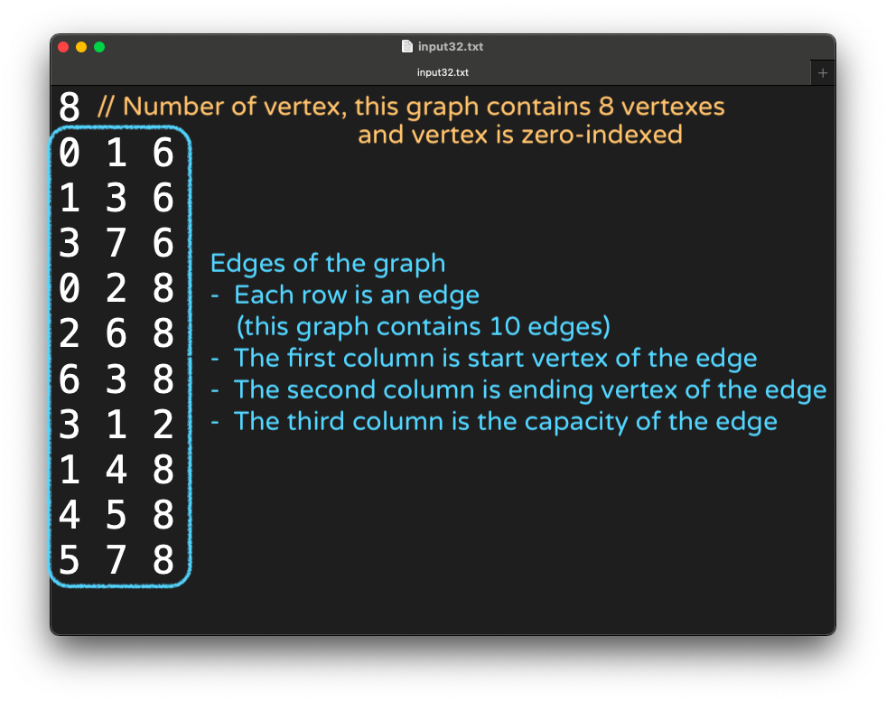
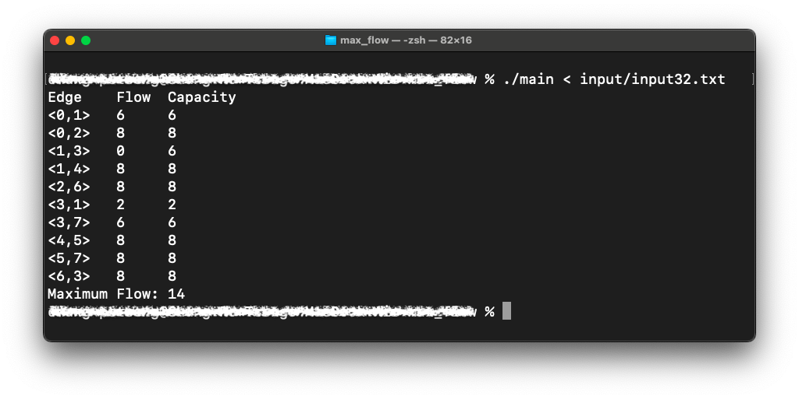

# Maximum Flow

This is a project of Introduction to Data Structure course [EE2510] @ NCKU Spring 2022

## Algorithm Implemented

- Edmonds-Karp

## Input

Input data are stored in the `input` folder
Input data should contain the following information of the graph:

<p align=center>
    
</p>

## Output

The capacity and ultimate flow of each edge will be shown, and the maximum flow will be shown as well

<p align=center>
    
</p>

## Getting Started

Please first use `make` command to create executable file:

```cmd
% make
```

Next, for macOS user, please use the following command to read input and run the program:

```cmd
% ./main < input/input32.txt
```
